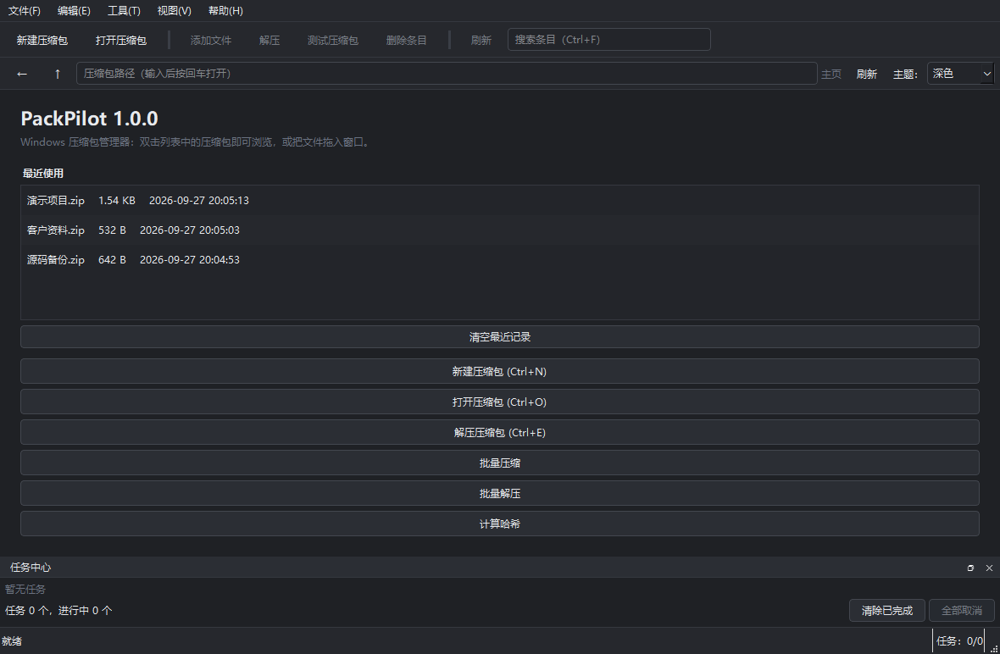
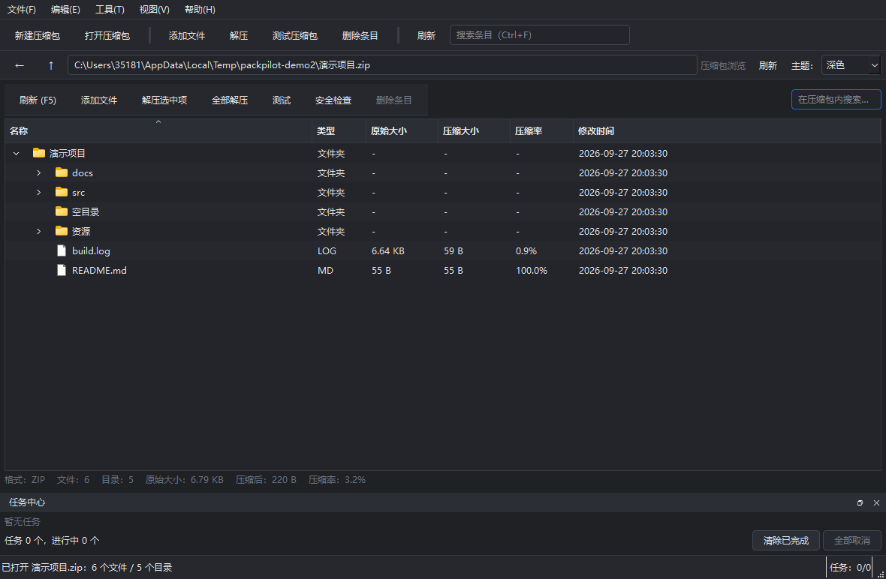

# PackPilot

PackPilot 是一款面向 Windows 的压缩包管理器，中文界面，支持 ZIP、7Z、TAR 系列的压缩、解压、浏览、测试、转换、批量操作、分卷与哈希校验。

## 功能

- 压缩与解压：ZIP、7Z、TAR、TAR.GZ、TAR.BZ2、TAR.XZ
- 压缩包浏览、搜索、排序与双击打开内部文件
- 批量压缩 / 批量解压，统一任务中心
- 压缩包测试与 SHA/MD5 哈希校验
- 密码保护（7Z AES-256，可加密文件头）
- 分卷压缩与完整性校验
- 拖拽文件、Windows 文件关联与右键菜单
- 命令行工具，与图形界面共用同一套核心逻辑

## 支持格式

| 格式 | 扩展名 | 创建 | 解压 | 测试 | 密码 | 分卷 |
| --- | --- | --- | --- | --- | --- | --- |
| ZIP | `.zip` | 支持 | 支持 | 逐条目 CRC | 仅读取（ZipCrypto） | 支持 |
| 7Z | `.7z` | 支持 | 支持 | 压缩流摘要 + 逐条目 CRC | AES-256（可加密文件头） | 支持 |
| TAR | `.tar` | 支持 | 支持 | 压缩流完整性 | 不支持 | 支持 |
| TAR.GZ | `.tar.gz` / `.tgz` | 支持 | 支持 | 压缩流完整性 | 不支持 | 支持 |
| TAR.BZ2 | `.tar.bz2` / `.tbz2` / `.tbz` | 支持 | 支持 | 压缩流完整性 | 不支持 | 支持 |
| TAR.XZ | `.tar.xz` / `.txz` | 支持 | 支持 | 压缩流完整性 | 不支持 | 支持 |

## 下载

Windows 10 / 11（64 位）用户可直接下载，发布包已内置运行环境，无需安装 Python：

| 版本 | 说明 | 下载 |
| --- | --- | --- |
| 安装版 | 安装到本机并创建开始菜单快捷方式，卸载时可一并移除文件关联 | [PackPilot-1.0.0-Setup.exe](https://github.com/huaz52029-lab/PackPilot/releases/download/v1.0.0/PackPilot-1.0.0-Setup.exe) |
| 便携版 | 解压即用，不写入安装信息 | [PackPilot-1.0.0-Portable.zip](https://github.com/huaz52029-lab/PackPilot/releases/download/v1.0.0/PackPilot-1.0.0-Portable.zip) |
| 校验值 | 上述两个文件的 SHA-256 | [SHA256SUMS.txt](https://github.com/huaz52029-lab/PackPilot/releases/download/v1.0.0/SHA256SUMS.txt) |

全部发布文件见 [Releases · v1.0.0](https://github.com/huaz52029-lab/PackPilot/releases/tag/v1.0.0)。

## 使用方法

**安装版**

1. 下载 `PackPilot-1.0.0-Setup.exe` 并运行；
2. 按向导完成安装（无需管理员权限，默认安装到当前用户目录）；
3. 从开始菜单或桌面快捷方式启动 PackPilot。

向导中的「关联压缩包格式」「添加资源管理器右键菜单」为可选项，默认不勾选，安装后也可在设置界面或卸载程序中移除。

**便携版**

1. 下载 `PackPilot-1.0.0-Portable.zip` 并解压；
2. 进入解压出的 `PackPilot` 目录；
3. 双击 `PackPilot.exe` 运行。

**命令行**

```bash
PackPilot.exe compress 输出.zip D:\项目目录
PackPilot.exe extract 输出.zip D:\解压目录
PackPilot.exe list 输出.zip
PackPilot.exe test 输出.zip
PackPilot.exe convert 输出.zip 输出.7z
PackPilot.exe hash 输出.zip --algorithm sha256
```

## 核心功能

- **压缩**：选择文件或文件夹、多选、拖拽添加，五档压缩等级，自定义输出路径与文件名。
- **解压**：解压全部或选中条目、智能解压（避免出现重复嵌套目录）、冲突处理（询问 / 覆盖 / 跳过 / 重命名）。
- **浏览压缩包**：显示名称、类型、原始大小、压缩大小、压缩率、修改时间，支持文件夹展开、搜索、排序与多选。
- **双击打开内部文件**：临时解压到系统临时目录，调用 Windows 默认程序打开，程序退出后清理临时文件。
- **压缩包测试**：完整读取数据并校验，损坏时列出具体失败条目。
- **批量操作**：批量压缩（每个文件夹独立压缩或合并为一个压缩包）、批量解压（多个压缩包统一加入任务队列）。
- **格式转换**：ZIP、7Z、TAR 系列互转，转换失败不会删除源文件。
- **密码保护**：按格式能力提供，7Z 使用 AES-256；不支持写入加密 ZIP（Python 标准库限制），会给出明确提示。
- **分卷压缩**：支持 100 MB / 500 MB / 1 GB / 2 GB / 自定义，生成 `.001`、`.002` … 与校验清单，缺失分卷会明确提示。
- **拖拽操作**：拖入压缩包直接打开，拖入普通文件可加入当前压缩包或新建压缩包。
- **任务管理**：压缩、解压、测试、转换、哈希、扫描统一进入任务中心，显示进度、速度、剩余时间，可取消。
- **哈希校验**：MD5、SHA-1、SHA-256、SHA-512，支持单文件、多文件与压缩包，可复制或导出 TXT。
- **Windows 集成**：文件关联与资源管理器右键菜单仅写入当前用户注册表，可完整卸载并恢复原有关联。
- **最近使用与任务历史**：主页显示最近打开的压缩包，任务历史记录时间、类型、源、目标、结果与耗时。
- **命令行**：`compress`、`extract`、`list`、`test`、`convert`、`hash`、`verify-volumes`、`associations`。

解压前会校验每个条目的最终路径是否位于目标目录内部，拒绝 `..`、绝对路径、盘符与 UNC 路径（Zip Slip 防护）；默认不覆盖已有文件；磁盘空间不足时禁止开始任务。

## 技术栈

- Python 3.13
- PySide6（Qt 6）
- `zipfile`
- `tarfile`
- `py7zr`
- PyInstaller
- Inno Setup

## 项目截图





## 开源许可

本项目使用 [MIT License](LICENSE)。

Copyright (c) 2026 PackPilot contributors
