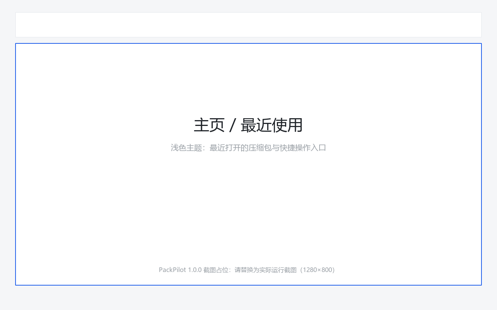
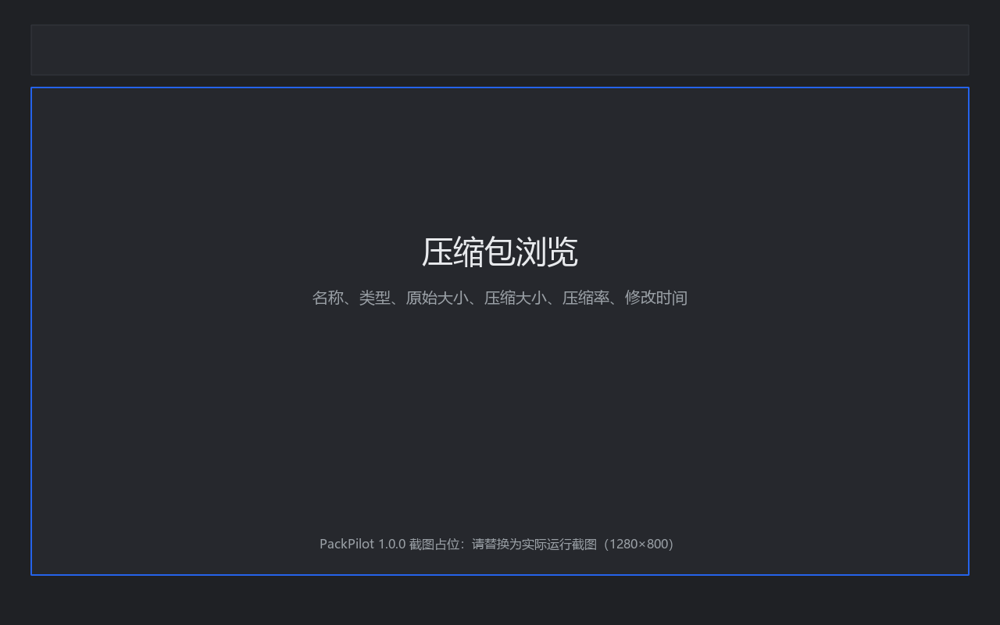
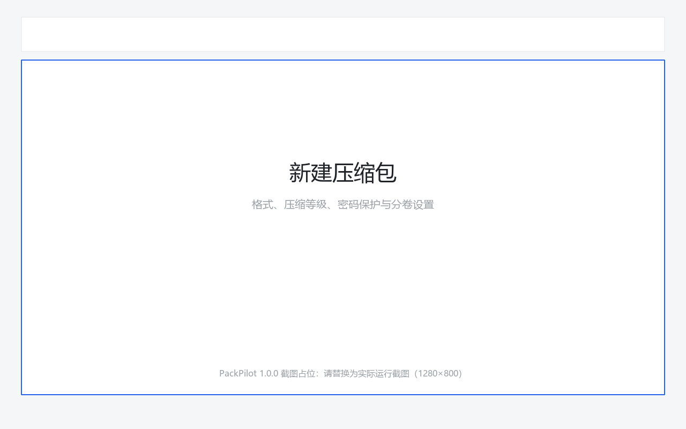
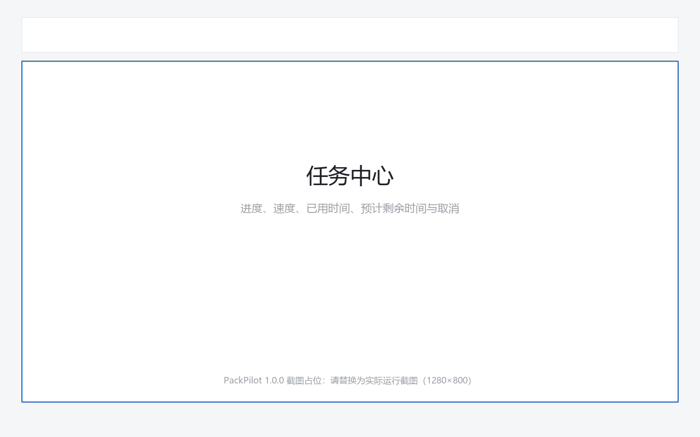

# PackPilot

PackPilot 是一款面向 Windows 的轻量级压缩包管理器，使用 Python 3.13 + PySide6 开发，
中文界面，支持 ZIP、7Z、TAR、TAR.GZ、TAR.BZ2、TAR.XZ 的创建、解压、浏览、测试、
格式转换、批量操作、密码保护、分卷压缩、哈希校验、Windows 系统集成与命令行调用。

核心压缩能力直接使用 Python 标准库 `zipfile` / `tarfile` 与 `py7zr`，
不自行设计加密算法；底层库不支持的能力会给出明确错误提示，不会伪造成功。

## 软件截图

> 截图占位区域：请在发布前替换为实际运行截图（建议 1280×800，深色与浅色各一张）。

| 主界面 | 压缩包浏览 |
| --- | --- |
|  |  |

| 新建压缩包 | 任务中心 |
| --- | --- |
|  |  |

## 核心功能

- **压缩**：选择文件/文件夹、多选、拖拽添加、自定义输出路径与文件名、五档压缩等级。
- **解压**：解压选中项或全部、解压到指定目录、智能解压、冲突处理（询问/覆盖/跳过/重命名）。
- **浏览**：双击压缩包进入浏览界面，显示名称、类型、原始大小、压缩大小、压缩率、修改时间；
  支持文件夹展开、搜索、排序、多选、右键菜单、刷新。
- **测试**：完整读取压缩包并校验数据（ZIP 逐条目 CRC、7Z 压缩流摘要与条目 CRC），
  显示进度与失败条目；TAR 系列校验压缩流完整性。
- **密码保护**：7Z 使用 py7zr 提供的 AES-256 加密，可加密文件头；读取加密 ZIP（ZipCrypto）时提示输入密码。
- **分卷**：ZIP / 7Z / TAR 系列均支持按 100 MB / 500 MB / 1 GB / 2 GB / 自定义大小分卷，
  生成 `project.zip.001`、`project.zip.002` … 与清单文件，并提供完整性校验与缺失分卷提示。
- **批量压缩 / 批量解压**：多文件夹分别压缩或合并压缩；多个压缩包统一加入任务队列。
- **格式转换**：ZIP ↔ 7Z ↔ TAR 系列互转，转换失败不会删除源文件。
- **哈希**：MD5、SHA-1、SHA-256、SHA-512，支持单文件、多文件与压缩包，可复制或导出 TXT。
- **任务中心**：所有耗时任务统一调度，显示进度、当前文件、速度、已用时间、预计剩余时间，可取消。
- **Windows 集成**：文件关联（.zip/.7z/.tar/.tar.gz/.tgz/.tar.bz2/.tar.xz 等）与资源管理器右键菜单，仅写入当前用户注册表。
- **最近使用与任务历史**：主页显示最近打开的压缩包，任务历史记录时间、类型、源、目标、结果与耗时。
- **命令行**：`packpilot compress|extract|list|test|convert|hash|verify-volumes|associations` 与 GUI 共用 Core 层。

## 支持格式

| 格式 | 扩展名 | 创建 | 解压 | 测试 | 密码 | 分卷 | 备注 |
| --- | --- | --- | --- | --- | --- | --- | --- |
| ZIP | `.zip` | ✅ | ✅ | ✅ 逐条目 CRC | 仅读取（ZipCrypto） | ✅ | 标准库无法写入加密 ZIP；AES ZIP 需 7-Zip |
| 7Z | `.7z` | ✅ | ✅ | ✅ 摘要 + 逐条目 CRC | ✅ AES-256（可加密文件头） | ✅ | 由 py7zr 提供 |
| TAR | `.tar` | ✅ | ✅ | ✅ 压缩流完整性 | ❌ | ✅ | TAR 不记录单条目压缩后大小 |
| TAR.GZ | `.tar.gz` / `.tgz` | ✅ | ✅ | ✅ 压缩流完整性 | ❌ | ✅ | gzip 校验和由标准库校验 |
| TAR.BZ2 | `.tar.bz2` / `.tbz2` / `.tbz` | ✅ | ✅ | ✅ 压缩流完整性 | ❌ | ✅ | |
| TAR.XZ | `.tar.xz` / `.txz` | ✅ | ✅ | ✅ 压缩流完整性 | ❌ | ✅ | |

## 技术栈

| 类别 | 选型 |
| --- | --- |
| 语言 / 运行时 | Python 3.13 |
| 图形界面 | PySide6（Qt 6） |
| 压缩 | `zipfile`、`tarfile`、`py7zr` |
| 并发 | `QThreadPool` + `QRunnable` + Signal/Slot |
| 文件系统 | `pathlib`、`shutil`、`tempfile`、`os` |
| 哈希 | `hashlib`（MD5 / SHA-1 / SHA-256 / SHA-512） |
| 配置 | JSON（`%APPDATA%\PackPilot\`） |
| 日志 | `logging`（`%LOCALAPPDATA%\PackPilot\logs\`） |
| 测试 | pytest、pytest-qt |
| 代码检查 | Ruff |
| 打包 | PyInstaller（Windows GUI 模式） |
| 安装程序 | Inno Setup 6 |

## 安装方法

### 方式一：使用安装程序（推荐）

1. 运行 `PackPilot-1.0.0-Setup.exe`；
2. 安装程序默认安装到 `%LOCALAPPDATA%\Programs\PackPilot`，无需管理员权限；
3. 可按需勾选“关联压缩包格式”“添加资源管理器右键菜单”；
4. 卸载时会自动移除文件关联与右键菜单。

### 方式二：绿色版

解压 `PackPilot` 目录后直接运行 `PackPilot.exe`，无需安装。

### 方式三：源码运行

```powershell
git clone https://github.com/huaz52029-lab/PackPilot.git
cd PackPilot
py -3.13 -m venv .venv
.\.venv\Scripts\python.exe -m pip install -r requirements.txt
.\.venv\Scripts\python.exe -m app.main
```

## 开发环境

```powershell
# 创建虚拟环境（Python 3.13）
py -3.13 -m venv .venv

# 安装运行依赖 + 开发依赖
.\.venv\Scripts\python.exe -m pip install -e ".[dev]"

# 代码检查
.\.venv\Scripts\python.exe -m ruff check app tests

# 运行测试
.\.venv\Scripts\python.exe -m pytest -q

# 启动 GUI
.\.venv\Scripts\python.exe -m app.main

# 启动 CLI
.\.venv\Scripts\python.exe -m app.cli.commands --version
```

## 使用方法

### 创建压缩包

1. 点击工具栏“新建压缩包”（Ctrl+N）；
2. 添加文件或文件夹（也可直接拖拽到窗口）；
3. 选择输出目录、文件名、压缩格式与压缩等级；
4. 需要时启用密码保护（仅 7Z 支持写入密码）或设置分卷大小；
5. 点击“开始压缩”，任务进入任务中心，可随时取消。

### 解压

1. 打开压缩包后点击“解压”（Ctrl+E）；
2. 对话框会显示压缩包名称、文件数量、压缩大小、预计解压大小、目标目录与剩余磁盘空间；
3. 磁盘空间不足时禁止开始任务并给出提示；
4. 选择智能解压可自动避免 `test/test/a.txt` 之类的重复嵌套，并避免大量文件污染当前目录；
5. 同名文件默认不会静默覆盖，可选择询问、跳过或重命名。

### 浏览与直接打开内部文件

双击压缩包进入浏览界面；双击内部文件会临时解压到 `%TEMP%\PackPilot\open\`，
调用 Windows 默认程序打开，并在程序退出后清理临时文件（若文件仍被占用，会在下次启动时重试）。

### 测试压缩包

点击“测试”（Ctrl+T）。测试会完整读取压缩包数据，显示已检查条目数量，并在损坏时列出具体失败文件。

### 分卷压缩

在新建压缩包对话框中选择分卷大小（或用 CLI `--volume-size`）。
生成的分卷为 `项目.zip.001`、`项目.zip.002` …，同时生成 `项目.zip.packpilot-parts.json` 清单，
记录每个分卷的大小与 SHA-256。缺失分卷时会明确提示缺少哪个文件，例如 `项目.zip.002`。

## CLI 使用方法

```bash
packpilot compress test.zip ./project
packpilot extract test.zip ./output
packpilot list test.zip
packpilot test test.zip
packpilot convert test.zip output.7z
packpilot --version
```

完整命令：

```text
packpilot [--version] [--quiet] <命令> ...

compress <target> <sources...> [--format zip|7z|tar|tar.gz|tar.bz2|tar.xz]
                                [--level fastest|fast|normal|high|ultra]
                                [--password PASSWORD] [--volume-size 100MB]
extract <archive> [target] [--password PASSWORD]
                           [--on-conflict overwrite|skip|rename|fail]
                           [--entries a,b,c]
list <archive> [--password PASSWORD] [--json]
test <archive> [--password PASSWORD] [--json]
convert <source> <target> [--level ...] [--password 源密码]
                          [--target-password 目标密码] [--volume-size 100MB]
hash <files...> [--algorithm md5|sha1|sha256|sha512] [--json] [--output 结果.txt]
verify-volumes <archive.001> [--json]
associations install|remove|status [--no-default]
```

退出码：`0` 成功，`1` 业务失败，`2` 参数错误，`3` 已取消。

## Windows 集成

### 文件关联

```powershell
PackPilot.exe --install-associations      # 安装
PackPilot.exe --association-status        # 查看状态
PackPilot.exe --remove-associations       # 移除
```

- 全部写入 `HKEY_CURRENT_USER`，不需要管理员权限；
- 支持的扩展名：`.zip`、`.7z`、`.tar`、`.tar.gz`、`.tgz`、`.tar.bz2`、`.tbz2`、`.tbz`、`.tar.xz`、`.txz`；
- 安装时会备份原有默认程序，移除时自动恢复；
- 同时注册 `RegisteredApplications` 能力，使 PackPilot 出现在“打开方式”与默认应用列表中。

### 资源管理器右键菜单

```powershell
PackPilot.exe --install-context-menu
PackPilot.exe --remove-context-menu
```

文件夹右键：

```text
PackPilot
├── 压缩为 ZIP
├── 压缩为 7Z
├── 压缩为…（选择格式）
└── 使用 PackPilot 打开
```

压缩包右键：

```text
PackPilot
├── 使用 PackPilot 打开
├── 解压到当前文件夹
├── 解压到指定位置…
└── 测试压缩包
```

菜单项实际调用 `PackPilot.exe --quick-*` 参数并启动 GUI 执行真实任务，不存在空按钮。

## 安全设计

- **Zip Slip / 路径穿越防护**：解压前规范化路径、计算最终输出路径并校验其位于目标目录内部，
  拒绝包含 `..`、绝对路径、盘符（`C:\...`）、UNC 路径（`\\server\share`）的条目，并记录日志、弹出安全提示。
- **不默认覆盖**：目标已存在时默认重命名为“名称 (1).ext”，绝不会静默覆盖用户文件。
- **磁盘空间检查**：解压前比较所需空间与目标磁盘剩余空间，空间不足时直接禁止开始任务。
- **解压炸弹防护**：按压缩率与解压后总大小分级告警/阻止（默认压缩率阈值 100:1 告警、1000:1 阻止，
  解压后总大小 4 GB 告警、64 GB 阻止），并限制条目数量与路径长度。
- **符号链接处理**：TAR/7Z 中的符号链接、硬链接与设备条目默认跳过，并在结果中提示。
- **超长路径**：Windows 下自动使用扩展长度路径（`\\?\`）重试，避免超长路径创建失败。
- **临时文件**：打开内部文件时解压到系统临时目录，程序退出后清理，残留文件在下次启动时清除。
- **不做提权**：所有操作均在当前用户权限下运行，不请求管理员权限。
- 详细威胁模型见 [docs/security.md](docs/security.md)。

## 项目结构

```text
PackPilot/
├── app/
│   ├── main.py                 # 统一入口：GUI / CLI / Windows 快速操作
│   ├── version.py              # 版本号唯一来源
│   ├── core/                   # 核心层（不依赖 PySide6）
│   │   ├── archive_manager.py  # 统一门面：格式分发、分卷、安全校验
│   │   ├── zip_engine.py       # ZIP 引擎
│   │   ├── sevenzip_engine.py  # 7Z 引擎
│   │   ├── tar_engine.py       # TAR 系列引擎
│   │   ├── archive_info.py     # 格式枚举、条目与压缩包元数据
│   │   ├── archive_security.py # 路径安全、磁盘空间、炸弹评估
│   │   ├── checksum.py         # 哈希计算
│   │   ├── converter.py        # 格式转换
│   │   ├── volumes.py          # 分卷切分/校验/零拷贝读取
│   │   └── smart_extract.py    # 智能解压目录决策
│   ├── tasks/                  # 任务层（QThreadPool）
│   ├── gui/                    # 界面层（PySide6）
│   │   ├── main_window.py
│   │   ├── archive_view.py
│   │   ├── task_panel.py
│   │   ├── theme.py
│   │   ├── dialogs/
│   │   └── widgets/
│   ├── services/               # 配置、最近使用、历史、日志、临时文件
│   ├── windows/                # 文件关联、右键菜单、ShellExecute
│   └── cli/                    # 命令行（复用 Core 层）
├── tests/                      # pytest 测试
├── resources/                  # 样式与图标
├── scripts/                    # 构建、图标、安装程序脚本
├── installer/                  # Inno Setup 配置
├── docs/                       # 架构、安全、CLI、开发文档
├── PackPilot.spec              # PyInstaller 配置
├── pyproject.toml
├── requirements.txt
├── CHANGELOG.md
└── README.md
```

## 开发历程

> 以下为项目开发历程与版本里程碑整理，用于记录从 0.1.0 到 1.0.0 的功能演进，
> 不代表每个版本均曾独立公开发布。这些日期仅用于记录项目整理后的开发里程碑，
> 并非已存在的 GitHub Release。

### 0.1.0 — 2026-09-21

项目启动。

完成：

- ZIP 创建
- ZIP 解压
- 基础 PySide6 GUI
- 文件选择
- 基础错误处理

### 0.1.1 — 2026-09-23

完成基础压缩包管理。

新增：

- 压缩包浏览
- 拖拽文件
- 压缩进度
- 解压进度
- 最近文件

### 0.2.0 — 2026-09-24

扩展压缩格式。

新增：

- 7Z
- TAR
- TAR.GZ
- 批量压缩
- 批量解压
- 任务队列

### 0.3.0 — 2026-09-25

高级压缩功能。

新增：

- 密码保护
- 分卷压缩
- 压缩包测试
- 压缩格式转换

### 0.4.0 — 2026-09-25

Windows 集成。

新增：

- 文件关联
- Windows 右键菜单
- 快捷键
- 文件拖放
- Windows 默认程序调用

### 0.5.0 — 2026-09-26

功能完善。

新增：

- 智能解压
- 磁盘空间检查
- 文件哈希
- 任务历史
- 最近使用
- CLI

### 0.6.0 — 2026-09-27

Release Candidate。

完成：

- 全功能测试
- Windows 11 测试
- 中文路径测试
- 大文件测试
- 异常处理
- Zip Slip 防护
- 性能优化
- UI 优化
- 打包测试

### 1.0.0 — 2026-09-27

正式版本。

PackPilot 1.0.0 正式发布。

## Roadmap

- 1.1.0：RAR 只读支持调研、压缩包注释编辑、可自定义压缩等级参数。
- 1.2.0：多标签浏览、拖拽调整压缩包内目录结构、断点续传式大批量任务。
- 1.3.0：ZIP AES 加密写入（依赖成熟第三方库评估）、更多分卷策略（按体积自动选择）。
- 2.0.0：插件式格式扩展接口、跨平台（Linux/macOS）适配评估。

以上为计划方向，不构成发布日期承诺。

## 构建方法

### PyInstaller 打包

```powershell
python scripts/build.py                 # 图标 → Ruff → pytest → PyInstaller
python scripts/build.py --skip-tests    # 仅打包
```

产物：`dist\PackPilot\PackPilot.exe`（Windows GUI 模式，`console=False`）。

在命令行中验证版本（GUI 子系统 exe 会附加到父控制台输出）：

```powershell
.\dist\PackPilot\PackPilot.exe --version
# PackPilot 1.0.0
```

### 生成安装程序

1. 安装 Inno Setup 6：<https://jrsoftware.org/isdl.php>
2. 执行：

```powershell
powershell -ExecutionPolicy Bypass -File scripts/build_installer.ps1
```

脚本会从 `app/version.py` 读取版本号，生成 `installer/version.iss` 与 Windows 版本资源，
并调用 ISCC 编译 `installer/PackPilot.iss`，产物为 `dist\PackPilot-1.0.0-Setup.exe`。

若未安装 Inno Setup，脚本会输出安装指引并保留已生成的配置。

## FAQ

**Q：为什么 ZIP 不能设置密码？**
A：Python 标准库 `zipfile` 只支持读取传统 ZipCrypto 加密包，不支持写入加密 ZIP。
PackPilot 不会自行实现加密算法，因此 ZIP 写密码会明确提示改用 7Z；7Z 使用 py7zr 的 AES-256 加密。

**Q：AES 加密的 ZIP 为什么无法解压？**
A：标准库不支持压缩方式 99（AES）。PackPilot 会提示改用 7-Zip 或请对方重新打包为 7Z。

**Q：解压时报“压缩包包含越界路径”怎么办？**
A：说明压缩包内存在 `../`、绝对路径或 UNC 路径等危险条目。PackPilot 已阻止解压以保护系统安全。
请在确认来源可信后，用支持路径清理的工具处理，或联系压缩包提供者。

**Q：为什么 TAR 的“压缩大小”显示为“-”？**
A：TAR 格式不记录单条目压缩后大小，界面与 CLI 会如实显示为未知，而不是伪造数值。

**Q：分卷压缩包缺少一个分卷怎么办？**
A：PackPilot 会明确提示缺少的分卷名（例如 `project.zip.002`），补齐后即可继续解压。

**Q：任务可以取消吗？**
A：可以。任务中心的每个任务都有“取消”按钮，也可以按 Esc 取消最近的任务。已写入的部分文件会被清理。

**Q：配置与日志在哪里？**
A：配置在 `%APPDATA%\PackPilot\`，日志在 `%LOCALAPPDATA%\PackPilot\logs\`，
可在“视图”菜单中一键打开目录。

**Q：为什么需要 Windows 11？**
A：PackPilot 以 Windows 11 为首要目标平台；Windows 10 也可以运行（安装程序要求 10.0 及以上）。

## License

本项目使用 MIT 许可证，详见 [LICENSE](LICENSE)。
